# BookIT

BookIT is a hotel booking application made with Next.js, React.js, Redux, Stripe and MongoDB.

## Features

- Book rooms in your favourite hotel
- Room availability check included
- Facilities mentioned
- Can add review after booking the room.
- Secure payment gateway using stripe.
- Users can reset the password using the forget passsword options.
- Admin panel included.
- Admins can create, update and delete rooms, reviews and bookings.
- Users can get the invoice of the rooms payment in pdf format.

## Tech

This application uses a number of libraries to work properly:

- [Next.js] - Next.js is an open-source development framework built on top of Node.js enabling React based web applications functionalities such as server-side rendering and generating static websites.
- [React.js] -  React is a free and open-source front-end JavaScript library for building user interfaces or UI components. It is maintained by Facebook and a community of individual developers and companies.
- [Redux] -  Redux is an open-source JavaScript library for managing and centralizing application state. It is most commonly used with libraries such as React or Angular for building user interfaces.
- [Stripe] - Stripe is an Irish-American financial services and software as a service company dual-headquartered in San Francisco, United States and Dublin, Ireland. The company primarily offers payment processing software and application programming interfaces for e-commerce websites and mobile applications.
- [MongoDB] - MongoDB is a source-available cross-platform document-oriented database program. Classified as a NoSQL database program, MongoDB uses JSON-like documents with optional schemas. 

And of course this application itself is open source with every code available here in github.

## Installation

Requires [Node.js](https://nodejs.org/) v10+ to run.

Install the dependencies and start the server.

```sh
cd BookIt
npm install
npm run start //to start the app in production
```

## Screenshot

##### Register

 Users can register by providing the details and submitting the application.
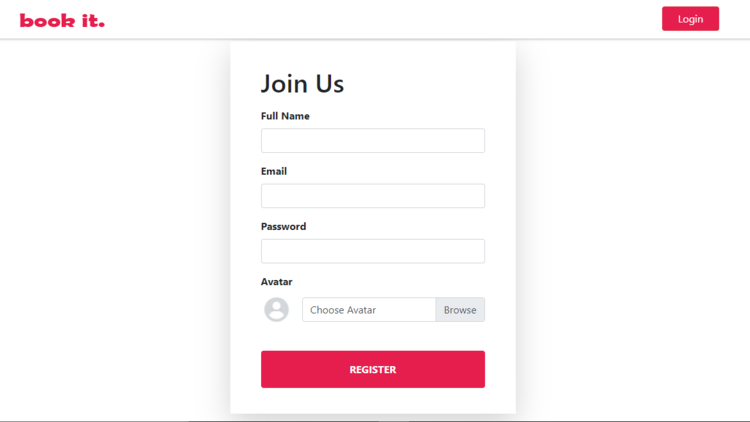

##### Login
Registered users can log in using this page.
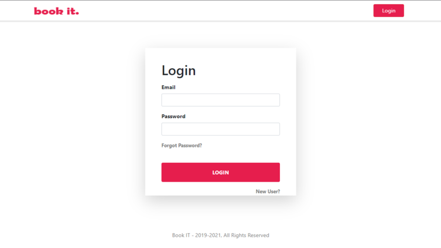

##### Forgot Password
- In case if the user forgots the password, he/she can retreive the account by providing the email-address. 
The link to retreive the account will be sent to the email-address.

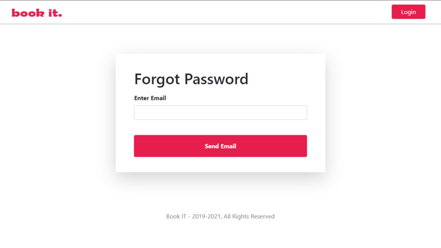

##### Main
- This is the main page of the application. Contains all the hotels available in this app. Each page contains four listing and use can see the remaining listings through the pagination.
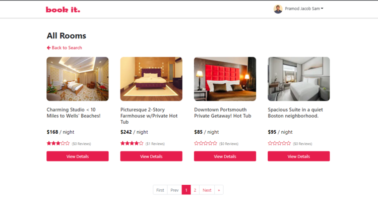

##### Room Details.
- This is the room details page and contains information about the room selected. User can check the availability of the room by selecting the dates in the calendar and book the room is the user is logged in.
- User can also submit a review once the room has been booked.
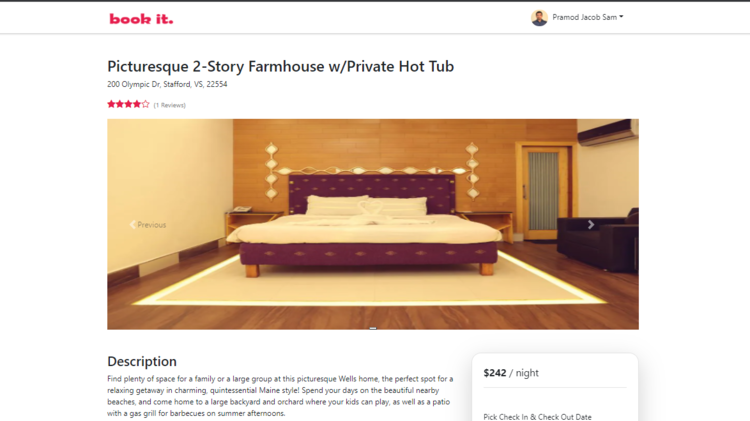
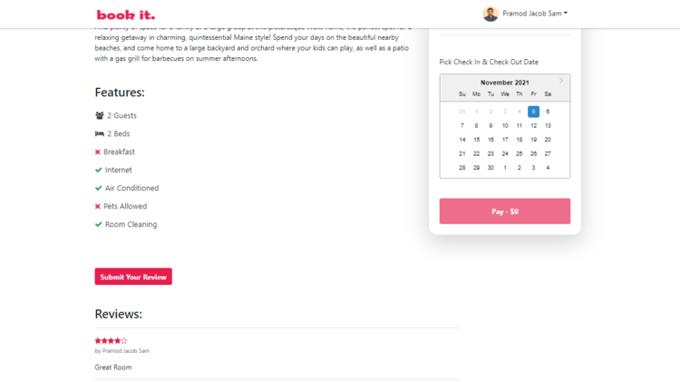

- Room can only be booked once the user is signed/logged in.

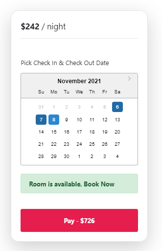

- If the user is not logged in, he/she cannot be able to book the room.

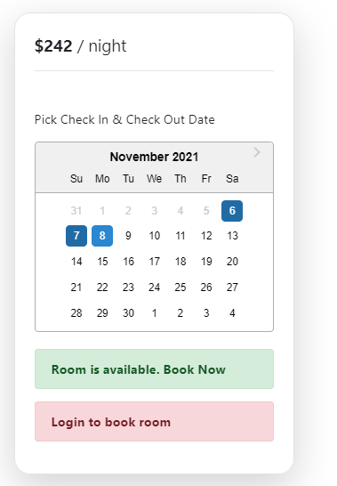

- Reviews can only be submitted once the user has booked the as well as when logged in.

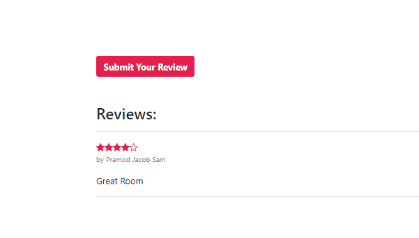

##### Dropdown Menu

As a User
- The options available to the user in the dropdown menu is "My Bookings", "Profile" and "Logout"
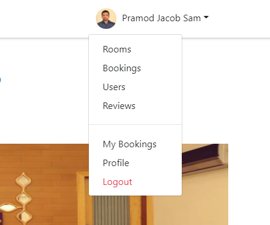

As an Admin
- The options available to the admin in the dropdown menu in addition to the user options are "Rooms","Bookings","Users" and "Review". Only the admin user will be
able to access this route and perform CRUD operation.
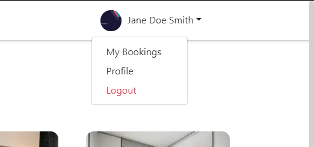

##### Profile
Path = MainPage  -> Profile (from dropdown)
- Users can update their profile using this page.
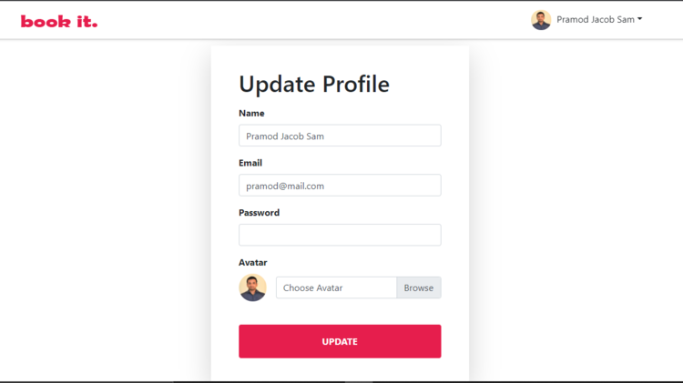

##### My Bookings
Path = MainPage  -> My Bookings (from dropdown)
- Users can see all their bookings using this route.Also users can check the booking details as well as download the room invoice
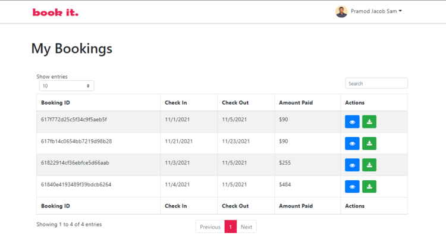
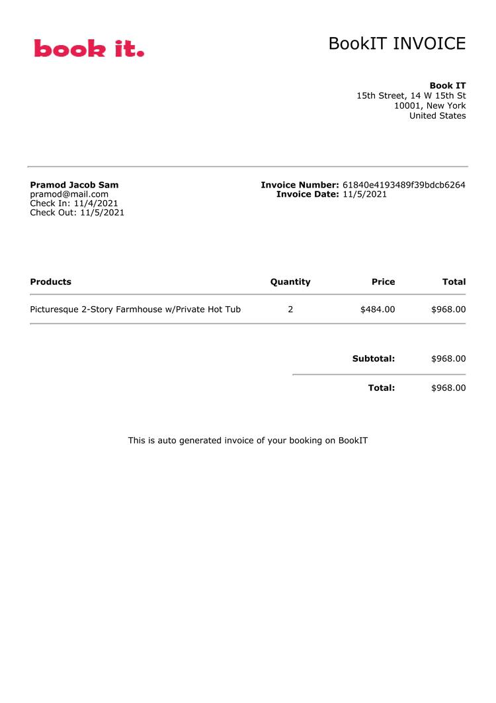

##### Rooms (Only Admin)
Path = MainPage  -> Rooms (from dropdown)
- Admins can see all the rooms as well as create, update and delete room as well.
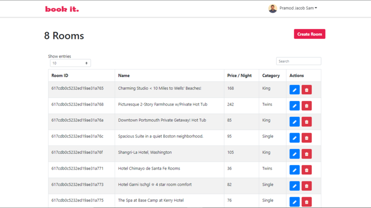

##### Bookings (Only Admin)
Path = MainPage  -> Bookings (from dropdown)
- Admins can see all the bookings as well as create, update and delete bookings as well.
- Admins can check the booking details as well as download invoice as well.


- An example image of how the invoice looks like:-


##### Users (Only Admin)
Path = MainPage  -> Users (from dropdown)
- Admins can see all the users as well as create, update and delete users as well.
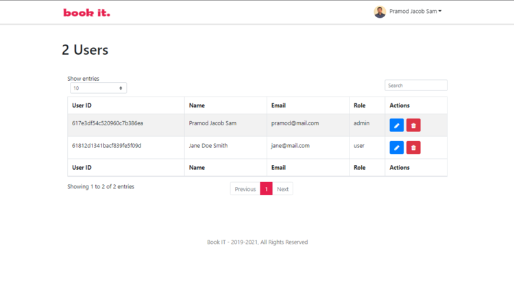

##### Reviews (Only Admin)
Path = MainPage  -> Reviews (from dropdown)
- Admins can see all the reviews using the "roomID" as well as create, update and delete reviews as well.
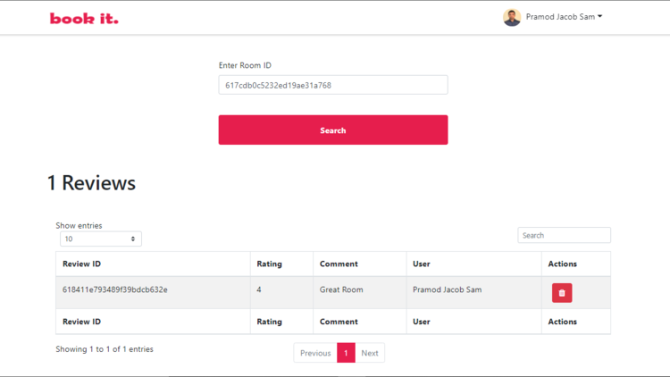

## Development

Want to contribute? Great!

BookIT uses Next.js and React.js for development.
Need to set environment variables in next.config.js file for the application to run. The environment variables that are need to be included are:-
- [DB_URI] - MongoDB database connection URI.
- [CLOUDINARY_CLOUD_NAME] - Cloudinary clound name for uploading image.
- [CLOUD_API_KEY] - Cloudinary clound api key.
- [CLOUD_API_SECRET] - Cloudinary cloud secret.
- [SMTP_HOST] - Mailtrap SMTP host name for receiving 'forgot password' link in the mail.
- [SMTP_PORT] - Mailtrap SMTP port number.
- [SMTP_USER] - Mailtrap SMTP user name.
- [SMTP_PASS] - Mailtrap SMTP password.
- [SMTP_FROM_NAME] - Mailtrap SMTP from name.
- [SMTP_FROM_EMAIL] - Mailtrap SMTP from email 
- [STRIPE_API_KEY] - Stripe API key.
- [STRIPE_SECRET_KEY] - Stipe secret key.
- [STRIPE_WEBHOOK_SECRET] - Stripe webhook secret.

Make a change in your file and instantaneously see your updates!.

Open your favorite Terminal and run these commands.

Terminal:

```sh
cd BookIT
npm install
npm run dev
```

Browser:

```sh
Open port 3000
```

Code Editor:
```sh
Start coding
```

## Note

- For development purpose, the environment variables needs to be added in the next.config.js file.
- The application uses Redux state management tool, but it is only activated in the development server for security reasons.
- Use 'npm run dev' to start the application in develpoment mode and 'npm run start' to start the application in production mode.
- Stripe webhook url is need to be added in the stripe account for the bookings to be completed. In development mode, use stripe webhook locally and for production mode, use  `https://{your-domain}/api/webhooks` for the bookings to be completed.

## Hosted
The link for the finished website - [Click Here](https://next-bookit.vercel.app/)


## License

MIT
